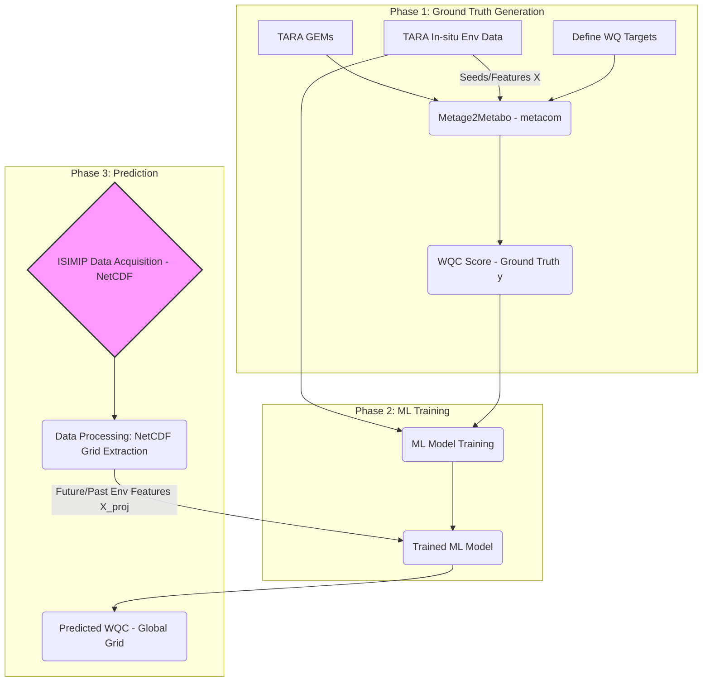

# Project: met2map 

Met2Map is a computational framework designed to predict the metabolic capacity of marine microbial communities and forecast how this capacity might change under future climate scenarios. By integrating genome-scale metabolic models (GEMs) with machine learning and climate projection data, this project aims to understand the functional potential of the ocean's microbiome and its impact on key biogeochemical cycles and water quality.

The workflow uses real-world metagenomic and environmental data from the TARA Oceans project as a baseline to train a predictive model. It then leverages climate model outputs from the Inter-Sectoral Impact Model Intercomparison Project (ISIMIP) to project these metabolic functions into the past and future.

## Aims
* Quantify metabolic potential: To use the metage2metabo toolkit to translate community-level genome-scale models (GEMs) from TARA Oceans samples into a quantifiable Water Quality Capacity (WQC) score. This score represents the community's potential to perform metabolic functions that influence water quality (e.g., nutrient cycling, pollutant degradation).

* Develop a predictive model: To train a machine learning model that learns the relationship between environmental conditions (temperature, salinity, nutrients, oxygen) and the community's WQC score. This creates a powerful tool to predict metabolic capacity directly from environmental data.

* Forecast biogeochemical change: To apply the trained model to historical and future climate projection data from ISIMIP. The goal is to generate global maps of predicted WQC, allowing us to visualize and analyze how the functional capacity of marine ecosystems might shift in response to climate change under different socioeconomic pathways (SSPs).

***

## Project Checklist

The following is a checklist of tasks to complete this project.



### **Phase -1: Repository Setup & Planning**

* [x] Initialize Git repository and create an initial commit.
* [x] Write a preliminary `README.md` outlining the project's goal and methodology.
* [x] Write generic helper functions for downloading data.
* [x] install software (metage2metabo).

### **Phase 0: Data aquisition**
**TARA Oceans Data**

* [x] Identify which Tara Oceans datasets are required.
* [x] Locate and list all direct download URLs for required data.

**ISIMIP Model Data**

* [ ] Identify the most relevant ISIMIP model outputs and inputs.
* [ ] Download the selected ISIMIP climate model outputs.
* [ ] Develop a Julia script map both datasets on a common raster.

**GEMs**
* [x] Download or create GEMs from TARA data.

### Phase 1: Functional profiling 

* [ ] Identify metabolites related to water quality (e.g., N2O production, methane oxidation, pollutant degradation) as targets.
* [ ] Figure out how to use the in-situ TARA environmental measurements as seeds (available nutrients) for the simulation.
* [ ] Run m2m metacom.
* [ ] Quantify water quality contribution. 

### Phase 2: Machine Learning (Linking Function to Environment)

* [ ] Data prepration
* [ ] Model testing and choosing the right aproach. 
* [ ] Model training
      
### Phase 3: Machine Learning (Linking Function to Environment)

* [ ] Process the ISIMIP NetCDF files to extract the environmental variables. 
* [ ] Use variables as input for ML model.
      
***

### Project Data Acquisition

This document outlines the procedures for downloading the project's metadata, raw metagenomic sequence data, and gene catalogs from the TARA Ocean project.

---

#### **1. BioSample Metadata (Project PRJEB7988)**

To understand the project's scope and sample details, BioSample metadata was first downloaded from the NCBI.

* **Tool Installation**: The NCBI Datasets command-line tool was installed via conda.
    ```bash
    conda install -c conda-forge ncbi-datasets-cli
    ```
* **Download Command**: A complete JSON data report for the project was downloaded using the `datasets summary` command.
    ```bash
    # Create a directory for the output
    mkdir -p data/metadata

    # Download the project metadata summary
    datasets summary bioproject PRJEB7988 > data/metadata/PRJEB7988_metadata.json
    ```
* **Output File**: The command generates a single JSON file (`PRJEB7988_metadata.json`) containing a structured report with rich BioSample metadata (e.g., collection date, host, isolation source) for each sample in the project.

---

#### **2. Metagenomic Sequence Data (Project ERP009009)**

The raw metagenomic sequence reads were sourced directly from the European Nucleotide Archive (ENA).

* **Dataset**: TARA Ocean metagenomic datasets, available under ENA study accession **ERP009009**. You can browse the project here: [https://www.ebi.ac.uk/ena/browser/view/ERP009009](https://www.ebi.ac.uk/ena/browser/view/ERP009009)
* **Download Method**: The data files were downloaded by running the `wget` shell script provided directly by the ENA repository for the project.
* **Execution Environment**: To ensure compatibility with the Linux-based shell script, Git Bash for Windows was used to execute the download commands.

---

#### **3. TARA Ocean Gene Catalogs (GEMS)**

The TARA Oceans prokaryotic gene catalogs (GEMS) were downloaded from Zenodo to provide a reference for functional analysis.

* **Datasets**: The specific datasets used are:
    * TARA Oceans prokaryotic genome and metagenome-assembled genome GEMS: [https://zenodo.org/records/5597227](https://zenodo.org/records/5597227)
    * TARA Oceans virome GEMS: [https://zenodo.org/records/5599412](https://zenodo.org/records/5599412)
* **Tool Installation**: The `zenodo-get` command-line tool was installed via pip.
    ```bash
    pip install zenodo-get
    ```
* **Download Command**: The gene catalogs were downloaded using their Zenodo record identifiers.
    ```bash
    # Create a directory for the gene catalogs
    mkdir -p data/gems

    # Download the TARA Oceans GEMS catalogs
    zenodo-get 10.5281/zenodo.5597227 -o data/gems/
    zenodo-get 10.5281/zenodo.5599412 -o data/gems/
    ```

## Getting Started

To get a local copy up and running, follow these simple steps.

1.  **Clone the repository:**
    ```bash
    git clone [https://github.com/your-username/your-repo-name.git](https://github.com/your-username/your-repo-name.git)
    cd your-repo-name
    ```

2.  **Install dependencies:**
    (Instructions will be added here once a dependency manager like `Project.toml` is set up.)

3.  **Run the analysis:**
    (Instructions for running the main script will be added here.)

***

## Contributing

Contributions are welcome but not required in such an early phase. 
