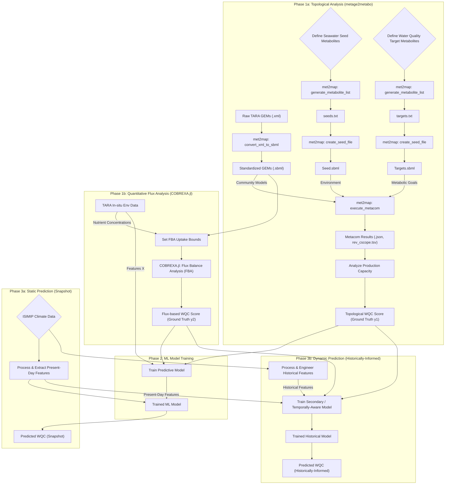
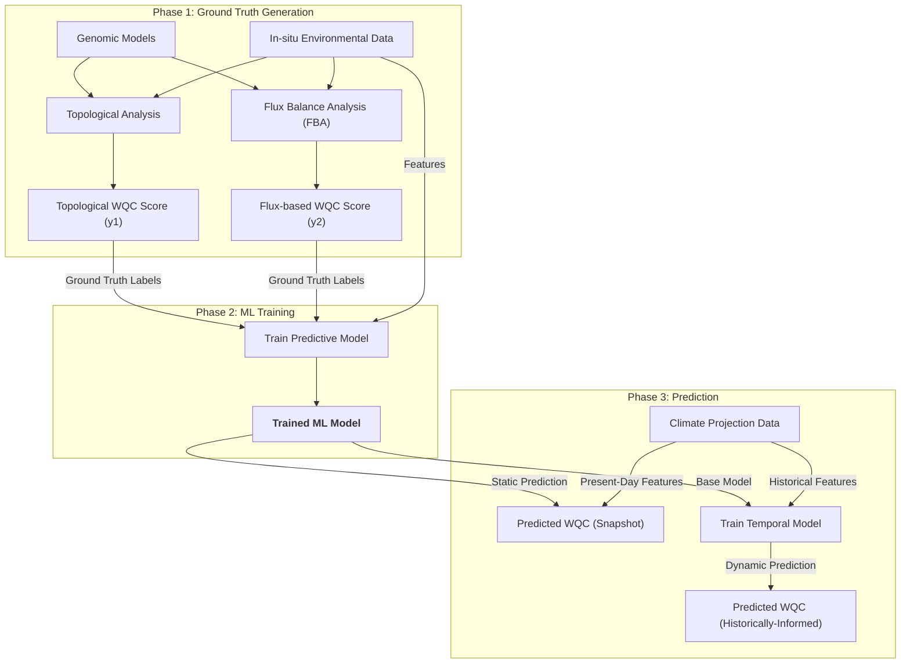
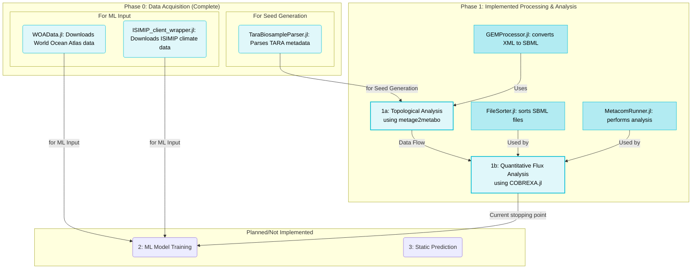

# Project: met2map 

Met2Map is a computational framework designed to predict the metabolic capacity of marine microbial communities and forecast how this capacity might change under future climate scenarios. By integrating genome-scale metabolic models (GEMs) with machine learning and climate projection data, this project aims to understand the functional potential of the ocean's microbiome and its impact on key biogeochemical cycles and water quality.

The workflow uses real-world metagenomic and environmental data from the TARA Oceans project as a baseline to train a predictive model. It then leverages climate model outputs from the Inter-Sectoral Impact Model Intercomparison Project (ISIMIP) to project these metabolic functions into the past and future.

## Aims
* Quantify metabolic potential: To use the metage2metabo toolkit to translate community-level genome-scale models (GEMs) from TARA Oceans samples into a quantifiable Water Quality Capacity (WQC) score. This score represents the community's potential to perform metabolic functions that influence water quality (e.g., nutrient cycling, pollutant degradation).

* Develop a predictive model: To train a machine learning model that learns the relationship between environmental conditions (temperature, salinity, nutrients, oxygen) and the community's WQC score. This creates a powerful tool to predict metabolic capacity directly from environmental data.

* Forecast biogeochemical change: To apply the trained model to historical and future climate projection data from ISIMIP. The goal is to generate global maps of predicted WQC, allowing us to visualize and analyze how the functional capacity of marine ecosystems might shift in response to climate change under different socioeconomic pathways (SSPs).

***

## Project Checklist

The following is a checklist of tasks to complete this project.



More condensed





### Project Data Acquisition

This document outlines the procedures for downloading the project's metadata, raw metagenomic sequence data, and gene catalogs from the TARA Ocean project. The scripts if they exist are located in the `/data_aquisition/` folder, and have their own project .toml to prevent dependency pollution in the main project.  

---

#### **1. BioSample Metadata (Project PRJEB7988)**

To understand the project's scope and sample details, BioSample metadata was first downloaded from the NCBI.

* **Tool Installation**: The NCBI Datasets command-line tool was installed via conda.
    ```bash
    conda install -c conda-forge ncbi-datasets-cli
    ```
* **Download Command**: A complete JSON data report for the project was downloaded using the `datasets summary` command.
    ```bash
    # Create a directory for the output
    mkdir -p data/metadata

    # Download the project metadata summary
    datasets summary bioproject PRJEB7988 > data/metadata/PRJEB7988_metadata.json
    ```
* **Output File**: The command generates a single JSON file (`PRJEB7988_metadata.json`) containing a structured report with rich BioSample metadata (e.g., collection date, host, isolation source) for each sample in the project.

---

#### **2. Metagenomic Sequence Data (Project ERP009009)**

The raw metagenomic sequence reads were sourced directly from the European Nucleotide Archive (ENA).

* **Dataset**: TARA Ocean metagenomic datasets, available under ENA study accession **ERP009009**. You can browse the project here: [https://www.ebi.ac.uk/ena/browser/view/ERP009009](https://www.ebi.ac.uk/ena/browser/view/ERP009009)
* **Download Method**: The data files were downloaded by running the `wget` shell script provided directly by the ENA repository for the project.
* **Execution Environment**: To ensure compatibility with the Linux-based shell script, Git Bash for Windows was used to execute the download commands.

---

#### **3. TARA Ocean Gene Catalogs (GEMS)**

The TARA Oceans prokaryotic gene catalogs (GEMS) were downloaded from Zenodo to provide a reference for functional analysis.

* **Datasets**: The specific datasets used are:
    * TARA Oceans prokaryotic genome and metagenome-assembled genome GEMS: [https://zenodo.org/records/5597227](https://zenodo.org/records/5597227)
    * TARA Oceans virome GEMS: [https://zenodo.org/records/5599412](https://zenodo.org/records/5599412)
* **Tool Installation**: The `zenodo-get` command-line tool was installed via pip.
    ```bash
    pip install zenodo-get
    ```
* **Download Command**: The gene catalogs were downloaded using their Zenodo record identifiers.
    ```bash
    # Create a directory for the gene catalogs
    mkdir -p data/gems

    # Download the TARA Oceans GEMS catalogs
    zenodo-get 10.5281/zenodo.5597227 -o data/gems/
    zenodo-get 10.5281/zenodo.5599412 -o data/gems/
    ```
Now we need to ensure adherence to the `.sbml` filetype. This is why we wrote a small function (`convert_xml_to_sbml`) that processes a list of .xml models derived from metaGEM (e.g., TARA Oceans models) and converts them to standardized .sbml files in an output directory. The process can be multi-threaded to significantly speed up the conversion of many files. 

```julia
    using met2map
    using Logging # I found the input files are not entirely SMBL compliant. print MANY warnings if not suppressed. 
    using .Threads

    # ensure smbl structure of GEMs
    indir = "some/dir/"
    outdir = "other/dir/"

    global_logger(NullLogger())

    Threads.@threads for file in readdir(indir, join=true)
        convert_xml_to_sbml(file, outdir) 
    end
```


    
#### **4. ISIMIP data aquisition**
Historical and future climate projection data were downloaded from the ISIMIP repository. To handle the large volume of data and ensure reproducibility, we developed a Julia wrapper for the official isimip-client Python library, the module ISIMIPClientPy. 

This client was used to search for and download all files matching the following criteria:

| Parameter | Value |
|:---:|:---:|
| Simulation Round | ISIMIP3b |
| Data Product | InputData and OutputData |
| Time Step | monthly |
| Region | global |
| Resolution | 60arcmin |
| Climate Models | gfdl-esm4, ukesm1-0-ll, mpi-esm1-2-hr |
| Scenarios | piControl, historical, ssp126, ssp370, ssp585 |
| Ocean Variables | thetao, so, o2, ph, no3, po4, si, fe |


#### **5. Acquiring World Ocean Atlas (WOA) data**

The WOAData module provides an interface for downloading data directly from the NOAA servers for the World Ocean Atlas 2018 and 2023 releases. The main function is download_woa_data, which downloads a single data file.

**Exploring Download Options**
Before downloading, you can inspect all available parameters by calling get_woa_options():

```julia
using Met2Map.WOAData

options = get_woa_options()

println("Available Years: ", options.years)
println("Available Variables: ", options.variables)
println("Available Resolutions: ", options.resolutions)

```

**Example: Download a single file**

The function takes several keyword arguments to specify the exact file you need. It returns a DownloadStatus object that tells you whether the download succeeded, failed, or was skipped.

```julia
using Met2Map.WOAData

# Download the annual mean temperature for the 1955-1964 climatology (WOA23)
status = download_woa_data(
    output_dir = "./woa_data",
    year = 2023,
    v = "t",
    gr = 1.00,
    climatology = "5564",
    period = "annual"
)

# You can check the result
if status.status == :downloaded
    println("Successfully downloaded: ", status.filepath)
end
```

**Script example: Downloading all months**

You can loop to download a series of files, such as all 12 months for a specific climatology. The function will automatically report the status of each attempt.

```julia
using Met2Map.WOAData

output_dir = "./woa_data"
results = []

for month in 1:12
    status = download_woa_data(
        output_dir = output_dir,
        year = 2018,
        v = "s", # Salinity
        gr = 0.25,
        climatology = "decav",
        period = month
    )
    push!(results, status)
end

# You can now inspect the results to see which files failed, if any.
failed_downloads = filter(s -> s.status == :failed, results)
if !isempty(failed_downloads)
    println("The following downloads failed:")
    for failure in failed_downloads
        println("- ", failure.url)
    end
end
```

---

## Running m2m metacom

**Goals**
Build a Julia wrapper for metage2metabo, and build the tooling that allows for quick building and executing of various experiments. Currently generates lists of metabolites, seeds and runs metacom. 

**Prerequisites**
* **m2m Docker Image:** You must have successfully built the m2m Docker image and tagged it as m2m. (as desribed in the metage2metabo readme).

### Setting up seeds (and targets)
Using `generate_metabolite_list` and `create_seed_file` from the met2map project.

```julia
project_dir = "D:/met2map"
metabolites_files = ["seeds/seeds.txt", "targets/targets.txt"]
output_dir = dirname.(metabolites_files)

# generate some seed base files
target_metabolites = [
    "M_bspa_e"     # Bisphenol A from Polycarbonate
]

seawater_seed_metabolites = [
    # Core Components
    "M_h2o_e", "M_h_e", "M_o2_e", "M_co2_e",
    # Major Nutrients
    "M_no3_e", "M_nh4_e", "M_pi_e", "M_so4_e",
    # Major Ions (Salts)
    "M_na1_e", "M_cl_e", "M_mg2_e", "M_ca2_e", "M_k_e",
    # Essential Trace Metals
    "M_fe3_e", "M_fe2_e", "M_zn2_e", "M_mn2_e", "M_cu2_e", "M_cobalt2_e",
    # Internal Currency Metabolites
    "M_atp_c", "M_adp_c", "M_amp_c", "M_nad_c", "M_nadh_c",
    "M_nadp_c", "M_nadph_c", "M_coa_c", "M_ppi_c"
]

seed_target = [target_metabolites, seawater_seed_metabolites]

for (output, metabolite) in zip(normpath.(joinpath.(project_dir, metabolites_files)), seed_target)
    generate_metabolite_list(
        metabolite,
        output
    )
end

for (met, out) in zip(metabolites_files, output_dir)
    create_seed_file(
        project_dir,
        String(met),
        out
    )
end
```
## Running metacom
Using running `metage2metabo` using the `execute_metacom` from the met2map project.

```julia
# run metacom
project_dir = "D:/met2map"
sample_dirs = readdir("D:/met2map/metage2metabo_TARA/p1/GEMs_smbl/", join = true)
sample_dirs = replace.(sample_dirs, project_dir => "")
results_dir = "metage2metabo_TARA/p1/metacom_results"
seeds_file = "seeds/seeds.sbml"
targets_file = "targets/seeds.sbml"

s = joinpath(project_dir, sample_dirs[1])

for sample in sample_dirs
    execute_metacom(
        project_dir,
        sample,
        results_dir,
        seeds_file,
        targets_file;
        m2m_threads=7 
    )
end
```

---

***

## Contributing

Contributions are welcome but not required in such an early phase. 
